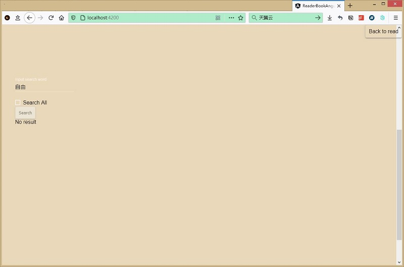

🚧 **Under Construction** 🚧

                

# EpubReader by Node.js & AngularCLI

`version: 0.1.0`  
· **Project based on** [epub.js](https://github.com/futurepress/epub.js)   
· **Fork Repo** [BookReaderAngular](https://github.com/ztftrue/BookReader/)  

## Preparation

- DevEnvironment: `Node.js v14.16.1` + `AngularCLI v11.2.8` + `Win32 x64`   
- DevLang: `HTML`, `TypeScript`, `JS`, `CSS`  
- DevTool: `Visual Studio Code`  

### Deployment of DevEnvironment

1. Install `Node.js` (LTS version)
- Visit the official website of [Node.js](https://nodejs.org/)
- Download the stable version according to your OS, [Win x64 installer](https://nodejs.org/dist/v14.16.1/node-v14.16.1-x64.msi)
- Install the msi to your system in the default directory
- Run command `node version` or use `where node` to locate the installation directory

if no `TypeScript` (optional, globe)
```
npm install -g typescript
```

2. Install `AngularCLI` by NPM source
- Run `node -v` `npm -v` to check the node.js version
- Run `npm install -g @angular/cli` 
- Run `ng v` to confirm the result
- if fail, install it again
```
npm uninstall -g angular-cli
npm install -g @angular/cli@latest 
```
or locate the directory of your project, then Run
```
npm i --save-dev @angular-devkit/core
``` 

## Git 
Clone the repo `https://github.com/5iCruise/epubreader`

## Build and Commit
Run `ng build` to build the project. 

The build artifacts will be stored in the `dist/` directory. Use the `--prod` flag for a production build.

## Deployment Server locally
Run `ng serve` for a dev server.

visit `http://localhost:4200/`

## Deployment by Github pages

```sh
ng build --prod --output-path docs --base-href /EpubReader/
```

When the build is complete, make a copy of *docs/index.html* and name it *docs/404.html* . Commit your changes and push.

On the GitHub project page, configure it to publish from the docs folder.

Then visit `https://darkwarrior2025.xyz/epubreader/`

## Preview





## ToDoList

- [ ] 改进 *书签、文摘* 功能;  
- [ ] 创建 **Electron** 项目 (本地化/离线);  
- [ ] 部署轻量化PWA, 实现部分资料的在线存储; 

## See More

- [刘明野的epub服务项目](https://epub.liumingye.cn/);    
- [AngularDocsGuide](https://angular.cn/docs);   
- [AngularCLI终极指南](https://segmentfault.com/a/1190000009771946);   

## -EOF-
